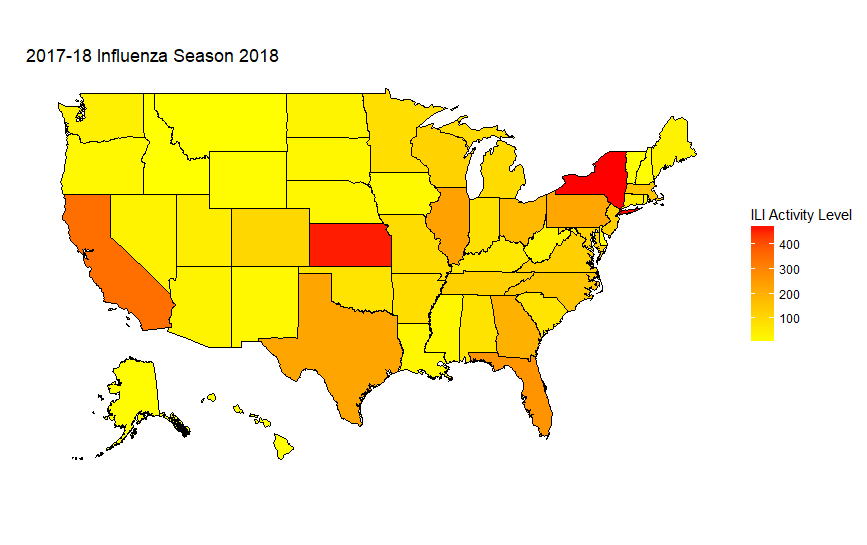
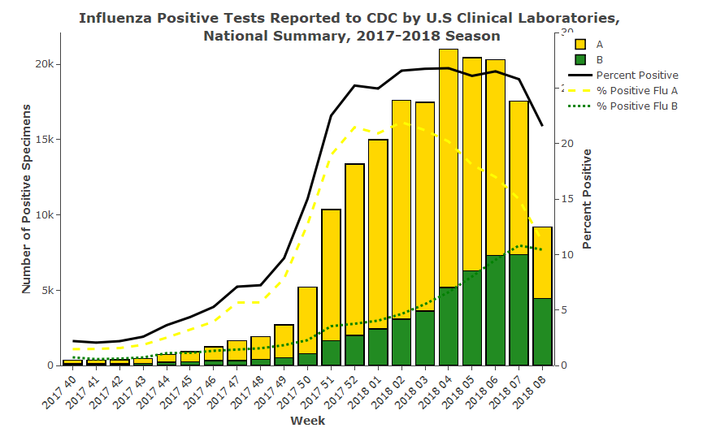
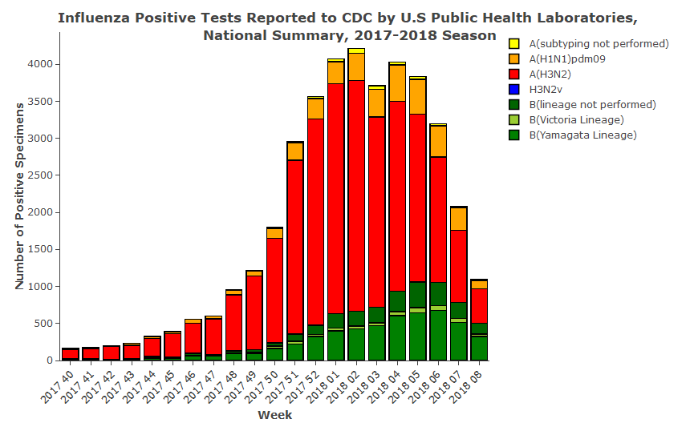
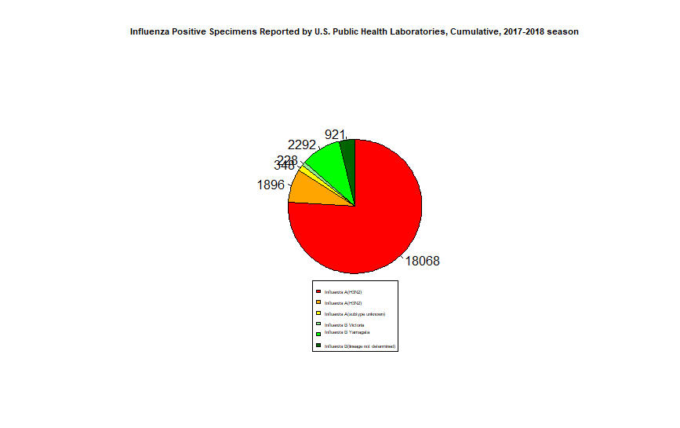
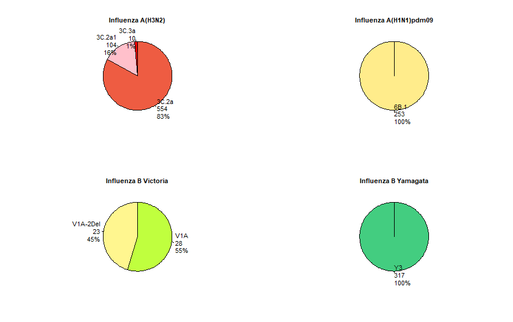
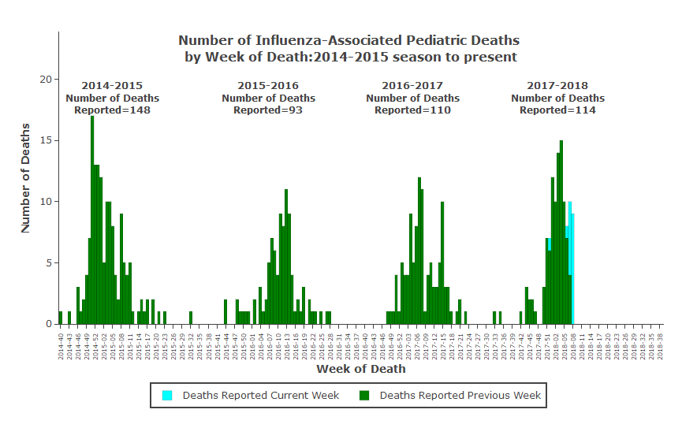
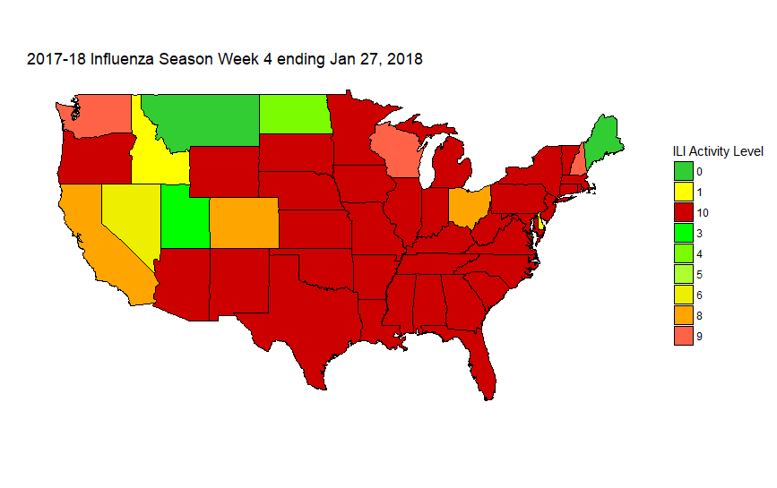

# Twitter-exploratory-data-analysis

In this project tweets related to the 2017-2018 flu season were collected using the twitterR api and they were processed to generate heat maps and plots.

Heat map for the 2017 flu season:

Plots:

